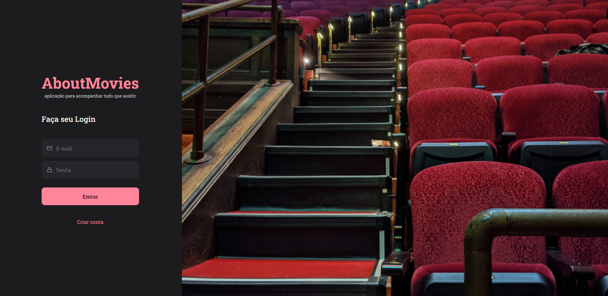
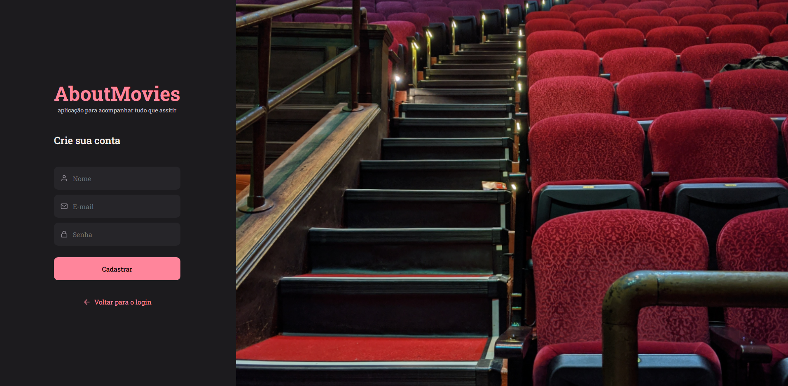
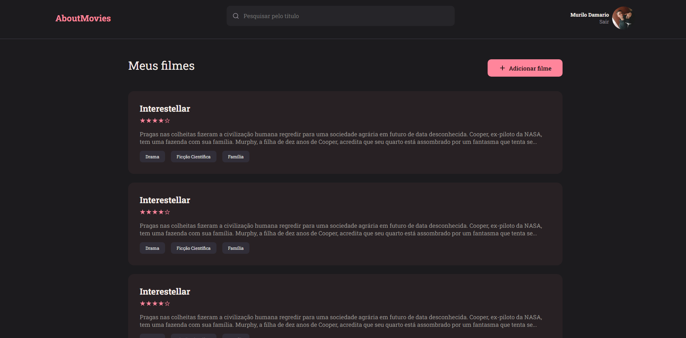
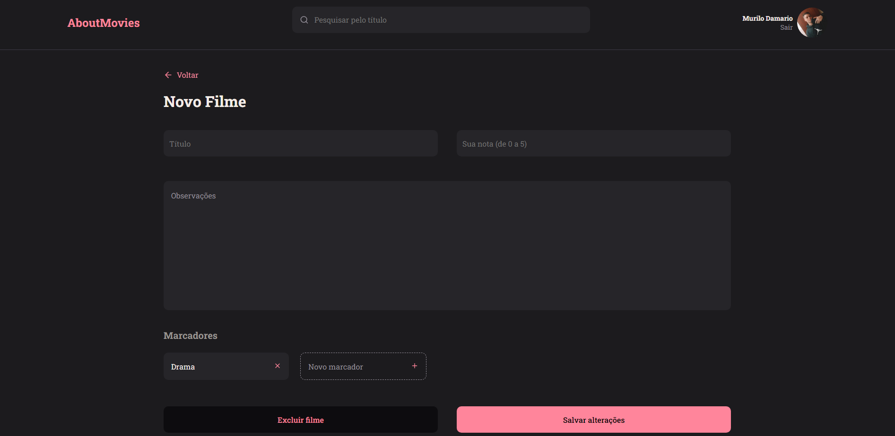
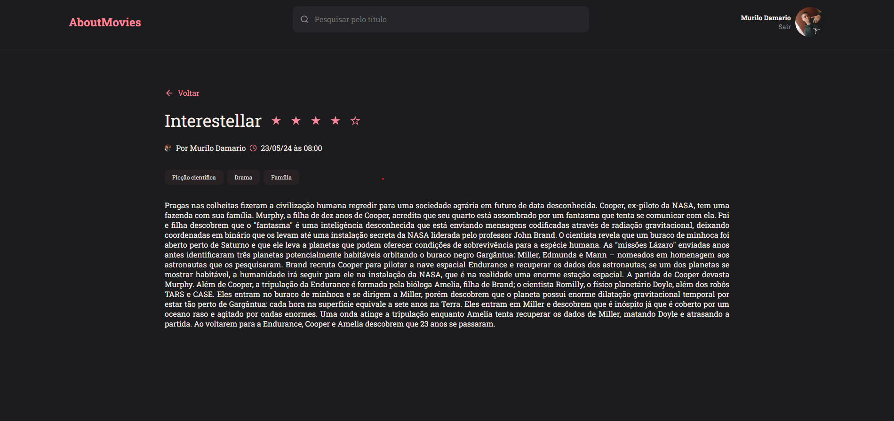
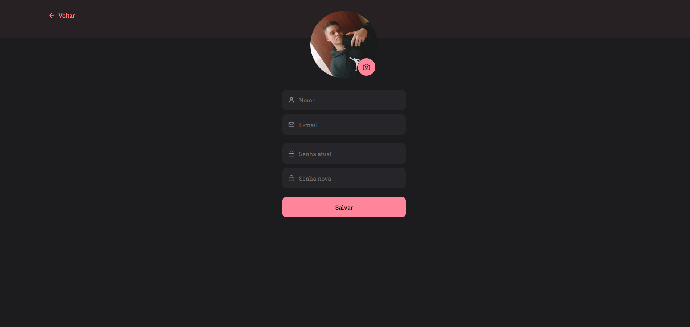

# AboutMovies 🍿

Front-End project with ReactJS to create a simple UI about movies that you like.

## Libs

- [styled-components](https://styled-components.com/)
  
  ```bash
  $ npm install --save styled-components
  ```
- [react-icons](https://react-icons.github.io/react-icons/)

   ```bash
   $ npm install react-icons --save
   ```
  
- [react-router-dom](https://www.npmjs.com/package/react-router-dom)

    ```bash
    $ npm install react-router-dom
    ```

## Screens

* Sign In
  


* Sign Up



* Home



* New Movie



* Moview Preview



* Profile
  

  
